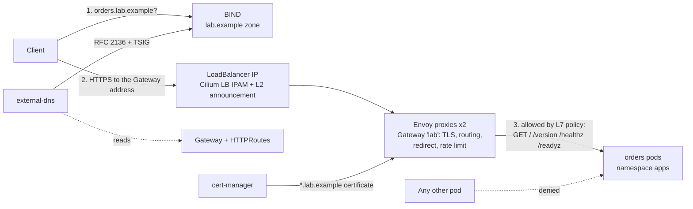

# Architecture

## Request path

1. The name `orders.lab.example` exists because external-dns saw an HTTPRoute with that hostname attached to the Gateway and wrote an A record (plus a TXT ownership record) into BIND.
2. The Gateway's address comes from a Cilium LoadBalancer IP pool; Cilium answers ARP for it on the kind network.
3. Envoy terminates TLS with the cert-manager certificate, applies the route (redirect on HTTP, rate limit and timeout on HTTPS) and forwards to the app. Cilium checks the request again at the pod: only the Envoy proxies, only listed GET paths.

## Components

| Component | Namespace | Role |
|---|---|---|
| Cilium | kube-system | CNI, kube-proxy replacement, LB IPAM, L2 announcements, network policy (L3-L7), Hubble |
| Envoy Gateway | envoy-gateway-system | Gateway API controller; runs the Envoy proxies for the `lab` Gateway |
| cert-manager | cert-manager | Lab CA and the wildcard certificate |
| Gateway `lab` | gateway | Listeners on 80 and 443 for `*.lab.example`; routes only from namespaces labelled `gateway-access=true` |
| orders (podinfo) | apps | Demo application, 2 replicas, hardened pod spec |
| BIND | dns | Authoritative server for `lab.example`; accepts only TSIG-signed updates and transfers |
| external-dns | dns | Publishes HTTPRoute hostnames to BIND (RFC 2136) |

## Who owns what (Gateway API roles)

| Object | Owner | Decides |
|---|---|---|
| `GatewayClass`, `EnvoyProxy` | Platform | Which controller, how proxies run (replicas, Service type) |
| `Gateway` | Platform | Listeners, certificates, which namespaces may attach routes |
| `HTTPRoute`, `BackendTrafficPolicy` | Application team | Hostnames, paths, backends, timeouts, rate limits |
| `NetworkPolicy`, `CiliumNetworkPolicy` | Application team, reviewed by platform/security | Who may reach the workload, and with which requests |

## Policy matrix (namespace `apps`)

| From | To | Allowed |
|---|---|---|
| Envoy proxies | orders:9898 | `GET` on `/`, `/version`, `/healthz`, `/readyz` only |
| kubelet (host) | orders:9898 | Health probes |
| Any other pod | orders | No |
| orders | kube-dns:53 | Yes |
| orders | anything else | No |

## What the end-to-end test checks

| Check | Proves |
|---|---|
| Gateway has an address | Cilium LB IPAM works with Envoy Gateway's LoadBalancer Service |
| HTTP → 301 to HTTPS | Redirect route on the HTTP listener |
| HTTPS with the lab CA reaches the app | TLS termination, certificate chain, routing |
| Certificate covers `*.lab.example` | cert-manager issued the right certificate |
| `/env` → 403 | Cilium L7 policy in front of the app |
| Pod in `default` cannot reach the app | Default deny; the gateway cannot be bypassed |
| 429 after a burst | Envoy Gateway local rate limit |
| `orders.lab.example` resolves to the Gateway address | external-dns → RFC 2136 → BIND |
| TXT ownership record in the zone | external-dns registry |
